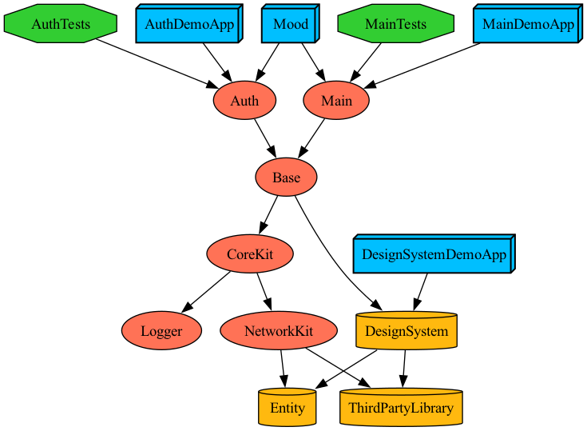

# Mood-iOS

## :white_check_mark: 프로젝트 사용방법
> 'Mood'는 Tuist 4.22.0 로 각 모듈 및 프로젝트를 관리하고 있습니다.

 <br/>
 
&emsp;**1.** XCConfig 설정하기

```sh
mkdir -p XCConfig && echo '#include "./Shared.xcconfig"' >> XCConfig/Debug.xcconfig && echo '#include "./Shared.xcconfig"' >> XCConfig/Release.xcconfig && echo '// Shared' >> XCConfig/Shared.xcconfig
```

&emsp;**2.** [Tuist 설치하기](https://tuist.io/)

&emsp;**3.** Dependecy 가져오기
```sh
tuist install
```

&emsp;**4.** 프로젝트 생성하기
```sh
tuist generate
```

&emsp;**5.** Feature 생성하기
```sh
tuist scaffold feature --name Auth
```

<br/>
<br/>

## :white_check_mark: Dependency Graph
> 'Mood' 는 Tuist 를 통해 의존성 그래프를 확인하고 있습니다.
<br/>

- 그래프 생성하기
```sh
tuist graph -d # 외부 라이브러리 제외
```


<br/>
<br/>


## :white_check_mark: 기술 스택

### 프레임워크
- SwiftUI, MVI Pattern, Combine, Concurrency(async & await)
### 외부 의존성
- kakao-ios-sdk, naveridlogin-sdk-ios, LinkNavigator, swift-dependencies, Alamofire, NukeUI

<br/>
<br/>

## :white_check_mark: MVI Template
> 'Mood'는 쉽고 빠르게 생산하기 위해 지정된 Template를 사용합니다.

- [사용방법](https://henryvoid.github.io/TemplateUsage/)
